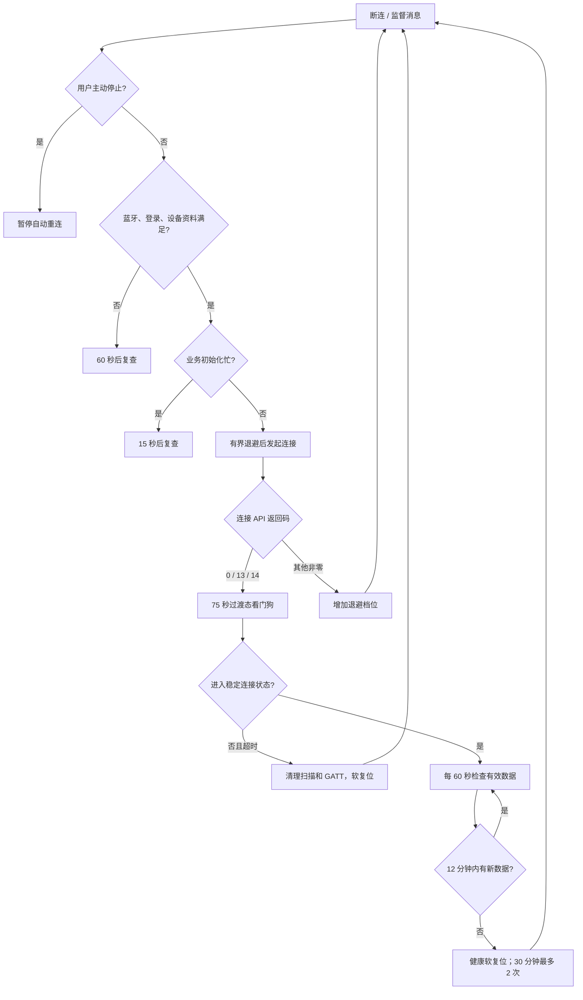

# 设计说明

## 1. 问题模型

原始现象不是单一故障：

1. 短时间离开手机后，重新打开 App 通常很快恢复；
2. 中长时间离开后，连接界面转圈数秒至十几秒才成功；
3. 部分情况下长时间不自动恢复，手动点击也无法连接；
4. 有时亮屏后才开始连接，提示灭屏期间扫描可能被系统暂停；
5. 某些探头算法只在特定手机/探头组合上触发 `VerifyError` 和原生 `SIGABRT`。

分析确认了四类根因：

- 扫描错误和 SDK Binder 断开错误地写入“用户主动停止”标志，阻断后续重连；
- Android 会在灭屏后暂停没有真实过滤条件的 callback BLE 扫描；
- 把探头末四位软件匹配键直接当成系统精确设备名，导致永远匹配不到完整广播名称；
- 运行时提取的部分算法 `AlgorithmContext.toString()` 方法体残缺，Android 16 在加载时抛出 `VerifyError`。

## 2. 重连状态机



### 退避时间

```text
首次：亮屏 1.5 秒 / 灭屏 5 秒
第 1 档：15 秒
第 2 档：30 秒
第 3 档：60 秒
第 4 档及以后：120 秒封顶
```

这不是“越快越好”的高频重试。BLE 扫描和 GATT 连接在失败时需要给 Android 蓝牙栈释放资源，持续无间隔请求会增加耗电、竞争和 `status=133` 风险。

## 3. 灭屏扫描

亮屏时保留 SDK 原本的全通过扫描，由软件回调按探头名称末四位匹配。

灭屏时构造三个非空 `ScanFilter`，列表内部为 OR 关系：

1. 完整设备名，例如 `P225086TTW`；
2. 兼容短名称，例如 `6TTW`；
3. 探头服务 UUID `0000ff30-0000-1000-8000-00805f9b34fb`。

服务 UUID 可能命中其他相似设备，所以所有结果仍必须经过 SDK 原有的末四位二次匹配才能进入 GATT 连接。

## 4. 数据健康

GATT 连接成功不等于数据链路健康。hf5 只在现有质量过滤通过后更新 `SystemClock.elapsedRealtime()`：

- 零值不刷新；
- 分钟占位值不刷新；
- 重复或旧时间戳不刷新；
- 墙上时钟变化不影响判断；
- 连续 12 分钟无有效新数据时软复位；
- 30 分钟内最多两次健康复位。

诊断只记录 `VALID_ENTITY_ACCEPTED`，不记录具体血糖数值。

## 5. 算法保护

算法工厂只接受四个显式标识。每个已知算法先执行：

1. `Class.forName()`；
2. 无参实例化；
3. `toString()` 预检；
4. 捕获包括 `VerifyError` 在内的所有 `Throwable`。

只有预检通过才创建业务包装类。未知、空、`null` 或预检失败返回 `null`；调用方走“不支持版本”分支，停止本次 BLE 初始化。

这是 fail-closed 设计：宁可暂时无读数，也不使用错误算法生成可能误导治疗的读数。

## 6. 隐私安全诊断

诊断写入 Logcat 和 App 私有 `SharedPreferences`，最多保留 200 条：

```text
wallTimeMillis|elapsedRealtimeMillis|EVENT_CODE
```

主要事件：

| 事件 | 含义 |
|---|---|
| `LOCAL_SERVICE_CREATE/START` | BLE 前台服务生命周期 |
| `STATE_n` | SDK 状态 |
| `CONNECT_START_RC_n` | 连接入口返回码 |
| `RETRY_SCHEDULE_ATTEMPT_n` | 退避档位 |
| `TRANSITION_TIMEOUT_75S` | 扫描/连接过渡态超时 |
| `SCAN_ERROR_RECOVER` | 扫描错误恢复 |
| `SDK_SERVICE_DISCONNECTED_RECOVER` | Binder 服务断开恢复 |
| `FILTERED_SCAN_SCREEN_OFF_MULTI_HF4` | 灭屏多过滤器扫描 |
| `UNFILTERED_SCAN_SCREEN_ON_HF4` | 亮屏全通过扫描 |
| `VALID_ENTITY_ACCEPTED` | 新有效数据到达，不含数值 |
| `DATA_STALE_12M` | 连接但数据超时 |
| `SOFT_RESET_REASON_n` | 限频软复位 |
| `HEALTH_RESET_LIMIT_2_PER_30M` | 健康复位达到上限 |

禁止记录血糖值、账号、手机号、令牌、MAC 地址、完整设备名、数据库记录和健康历史。

## 7. 有意不做的事

- 不采用无上限高频扫描或连接循环；
- 不在 Binder 断开后无条件从后台重新启动前台服务；Android 12+ 可能拒绝该操作；
- 不改变认证、加密、BLE 协议或原生血糖算法；
- 不把未来算法默认映射到“最相似”版本；
- 不把一次亮屏恢复当作灭屏成功；
- 不承诺在探头不广播、信号不可达或被另一手机占用时仍能恢复。
